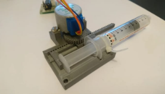

# Arduino Infusion Pump Monitoring System

## **Overview**
This project implements an **Arduino-based infusion pump controller** with real-time monitoring and safety features. It controls a stepper motor to adjust fluid flow, monitors heart rate, measures remaining syringe volume using an ultrasonic sensor, and displays system information on an **OLED screen**. Safety features include an **IR sensor for syringe detection**, a **buzzer alarm**, and **LED indicators**.

---

## **Features**
- ✅ Stepper motor control for syringe plunger movement  
- ✅ Forward and backward control using **push buttons**  
- ✅ **Flow rate calculation** based on motor speed  
- ✅ **Ultrasonic sensor** to estimate syringe plunger position (remaining volume)  
- ✅ **OLED display** to show:
  - Current Volume (ml)
  - Flow Rate (ml/s)  
- ✅ **Pulse Sensor** to monitor patient heart rate (BPM)  
- ✅ **IR sensor** to detect syringe presence  
- ✅ **Buzzer and LED alarm** when syringe is finished  
- ✅ Safety mechanism to stop motor when target volume is reached  

---

## **Hardware Components**
- Arduino UNO / Nano  
- **Stepper Motor** (28BYJ-48 with ULN2003 driver)  
- **Push Buttons** (for forward & backward movement)  
- **Ultrasonic Sensor** (HC-SR04)  
- **Pulse Sensor**  
- **IR Sensor**  
- **OLED Display** (Adafruit SSD1306)  
- **Buzzer**  
- **LED indicators**  
- Syringe setup for testing  

---

## **Circuit Connections**
| Component         | Pin             |
|-------------------|---------------|
| Stepper Motor IN1 | D4           |
| Stepper Motor IN2 | D5           |
| Stepper Motor IN3 | D6           |
| Stepper Motor IN4 | D7           |
| Button Forward    | A2           |
| Button Backward   | A3           |
| Ultrasonic TRIG   | D13          |
| Ultrasonic ECHO   | D12          |
| IR Sensor         | D3           |
| Heart LED         | D8           |
| Syringe LED       | D9           |
| Buzzer            | D11          |
| Pulse Sensor      | A0           |
| OLED Display      | SDA, SCL     |

---

## **Libraries Used**
Install these libraries via Arduino IDE **Library Manager**:
- [Adafruit SSD1306](https://github.com/adafruit/Adafruit_SSD1306)
- [Adafruit GFX](https://github.com/adafruit/Adafruit-GFX-Library)
- [PulseSensor Playground](https://github.com/WorldFamousElectronics/PulseSensorPlayground)
- **Stepper.h** (built-in)
- **Wire.h** and **SPI.h** (built-in)

---

## **How It Works**
1. **Startup**:
   - Initializes OLED display, sensors, and motor.
2. **Motor Control**:
   - Use **Forward button (A2)** to push syringe (infusion).
   - Use **Backward button (A3)** to retract syringe.
3. **Volume Calculation**:
   - Ultrasonic sensor measures plunger distance → converts to **volume (ml)**.
4. **Flow Rate**:
   - Based on stepper speed:
     - Speed = 3 → 0.8 ml/s
     - Speed = 4 → 0.9 ml/s
     - Speed = 5 → 1.0 ml/s
5. **Display**:
   - Volume & Flow Rate on OLED.
6. **Safety & Alerts**:
   - IR Sensor detects syringe empty → LED ON + Buzzer Alarm.
   - Stops motor if target volume reached.
7. **Heart Monitoring**:
   - Displays BPM in Serial Monitor for patient safety.

---

## **Usage**
1. Connect all components as per the circuit.
2. Upload the code to Arduino.
3. Power on the system.
4. Press **Forward** to start infusion, **Backward** to retract.
5. Monitor OLED for volume & flow rate updates.
6. Check Serial Monitor for BPM.

---

## **Future Improvements**
- Add **automatic flow control** based on heart rate.
- Implement **menu navigation on OLED**.
- Add **Bluetooth/WiFi module** for remote monitoring.
- Use **closed-loop feedback** for accurate dosing.

---

## **Safety Disclaimer**
This project is for **educational purposes only**. It is not certified for medical use and should **not** be used on actual patients.

---

